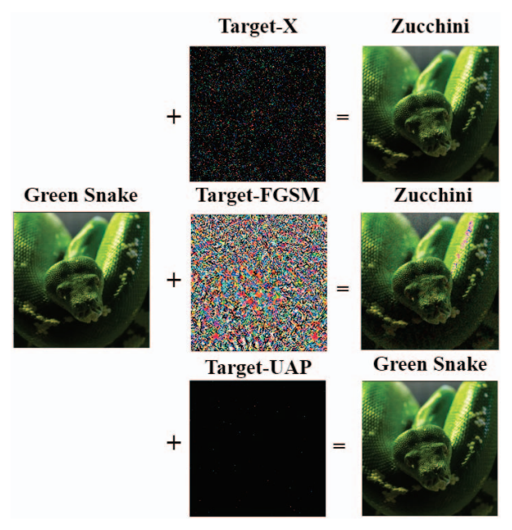

# Target-X
<p align="center">
  
</p>
This repository introduces Target-X, a novel and fast method for the construction of adversarial targeted images on large-scale datasets that can fool the state-of-the-art image classification neural networks. We evaluate the performance of Target-X using the well-trained image classification neural networks of different architectures and compare it with the well-known T-FGSM and T-UAP targeted attacks. The reported results demonstrate that Target-X can generate targeted adversarial images with the least perturbations on large-scale datasets that can fool the image classification neural networks and significantly outperform the T-FGSM and T-UAP attacks.

## Results
Here we show our work, Target-X, compared to two other adversarial attacks, T-FGSM and T-UAP. We compare with four metrics:
- **A<sub>f**, denoting the average prediction accuracy of the architecture on the original images.
- **P<sub>f**, denoting the average robustness of the perturbations on the the prediction accuracy of the architecture.
- **T<sub>f**, denoting the success rate of targeted perturbations.
- **E<sub>f**, denoting the average execution time.

Four tables are given, each showing the result of testing with different perturbation sizes (Ɛ). Areas where Target-X outperforms other techniques are shown in **bold**.

### Ɛ = 0.0005
| Algorithm    | Architecture    | A<sub>f</sub> | P<sub>f</sub> | T<sub>f</sub> | E<sub>f</sub> |
|--------------|-----------------|---------------|---------------|---------------|---------------|
| **Target-X** | AlexNet         | 0.573         | **0.302**     | **0.596**     | 0.7754        |
|              | DenseNet-201    | 0.766         | **0.184**     | **0.803**     | 3.9975        |
|              | GoogleNet       | 0.697         | **0.129**     | **0.859**     | 0.8496        |
|              | ResNet-34       | 0.739         | **0.108**     | **0.867**     | 2.4447        |
|              | Resnet-101      | 0.775         | **0.155**     | **0.824**     | 0.8557        |
|              | VGG-19          | 0.730         | **0.292**     | **0.618**     | 2.7172        |
| T-FGSM       | AlexNet         | 0.573         | 0.568         | 0.0380        | 0.0187        |
|              | DenseNet-201    | 0.766         | 0.762         | 0.0418        | 0.1566        |
|              | GoogleNet       | 0.697         | 0.694         | 0.0520        | 0.0466        |
|              | ResNet-34       | 0.739         | 0.730         | 0.0528        | 0.0840        |
|              | ResNet-101      | 0.775         | 0.772         | 0.0492        | 0.0350        |
|              | VGG-19          | 0.730         | 0.725         | 0.0550        | 0.0723        |
| T-UAP        | AlexNet         | 0.573         | 0.573         | 0.0110        | 0.4741        |
|              | DenseNet-201    | 0.766         | 0.766         | 0.0150        | 3.9476        |
|              | GoogleNet       | 0.697         | 0.697         | 0.0120        | 1.1437        |
|              | ResNet-34       | 0.739         | 0.739         | 0.0080        | 2.0902        |
|              | ResNet-101      | 0.775         | 0.775         | 0.0012        | 0.8952        |
|              | VGG-19          | 0.730         | 0.730         | 0.0080        | 1.7886        |

### Ɛ = 0.005
| Algorithm    | Architecture    | A<sub>f</sub> | P<sub>f</sub> | T<sub>f</sub> | E<sub>f</sub> |
|--------------|-----------------|---------------|---------------|---------------|---------------|
| **Target-X** | AlexNet         | 0.573         | **0.066**     | **0.941**     | 0.2242        |
|              | DenseNet-201    | 0.766         | **0.029**     | **0.991**     | 0.8817        |
|              | GoogleNet       | 0.697         | **0.036**     | **0.986**     | 0.1952        |
|              | ResNet-34       | 0.739         | **0.026**     | **0.992**     | 0.5791        |
|              | Resnet-101      | 0.775         | **0.032**     | **0.983**     | 0.1760        |
|              | VGG-19          | 0.730         | **0.080**     | **0.887**     | 1.0760        |
| T-FGSM       | AlexNet         | 0.573 | 0.464 | 0.4048 | 0.0184 |
|              | DenseNet-201    | 0.766 | 0.547 | 0.4332 | 0.1568 |
|              | GoogleNet       | 0.697 | 0.476 | 0.4818 | 0.0461 |
|              | ResNet-34       | 0.739 | 0.461 | 0.5094 | 0.0844 |
|              | ResNet-101      | 0.775 | 0.535 | 0.4498 | 0.0348 |
|              | VGG-19          | 0.730 | 0.449 | 0.5300 | 0.0734 |
| T-UAP        | AlexNet         | 0.573 | 0.573 | 0.0090 | 0.4629 |
|              | DenseNet-201    | 0.766 | 0.766 | 0.0100 | 3.9603 |
|              | GoogleNet       | 0.697 | 0.697 | 0.0100 | 1.1440 |
|              | ResNet-34       | 0.739 | 0.739 | 0.0120 | 2.0899 |
|              | ResNet-101      | 0.775 | 0.775 | 0.0130 | 0.8991 |
|              | VGG-19          | 0.730 | 0.730 | 0.0100 | 1.7888 |

### Ɛ = 0.05
| Algorithm    | Architecture    | A<sub>f</sub> | P<sub>f</sub> | T<sub>f</sub> | E<sub>f</sub> |
|--------------|-----------------|---------------|---------------|---------------|---------------|
| **Target-X** | AlexNet         | 0.573 | **0.038** | **0.980** | 0.0831 |
|              | DenseNet-201    | 0.766 | **0.022** | **0.997** | 0.3809 |
|              | GoogleNet       | 0.697 | **0.030** | **0.996** | 0.0989 |
|              | ResNet-34       | 0.739 | **0.022** | **0.996** | 0.2766 |
|              | Resnet-101      | 0.775 | **0.022** | **0.993** | 0.0883 |
|              | VGG-19          | 0.730 | **0.054** | 0.923 | 0.5926 |
| T-FGSM       | AlexNet         | 0.573 | 0.062 | 0.9620 | 0.0186 |
|              | DenseNet-201    | 0.766 | 0.122 | 0.9010 | 0.1565 |
|              | GoogleNet       | 0.697 | 0.107 | 0.9164 | 0.0458 |
|              | ResNet-34       | 0.739 | 0.077 | 0.9410 | 0.0838 |
|              | ResNet-101      | 0.775 | 0.161 | 0.8590 | 0.0349 |
|              | VGG-19          | 0.730 | 0.075 | 0.9456 | 0.0701 |
| T-UAP        | AlexNet         | 0.573 | 0.573 | 0.0110 | 0.4631 |
|              | DenseNet-201    | 0.766 | 0.766 | 0.0100 | 3.9629 |
|              | GoogleNet       | 0.697 | 0.697 | 0.0090 | 1.1443 |
|              | ResNet-34       | 0.739 | 0.739 | 0.0090 | 2.0854 |
|              | ResNet-101      | 0.775 | 0.775 | 0.0090 | 0.9002 |
|              | VGG-19          | 0.730 | 0.731 | 0.0120 | 1.7865 |

### Ɛ = 0.2
| Algorithm    | Architecture    | A<sub>f</sub> | P<sub>f</sub> | T<sub>f</sub> | E<sub>f</sub> |
|--------------|-----------------|---------------|---------------|---------------|---------------|
| **Target-X** | AlexNet         | 0.573 | 0.034 | 0.981 | 0.0826 |
|              | DenseNet-201    | 0.766 | **0.024** | **0.999** | 0.3818 |
|              | GoogleNet       | 0.697 | **0.027** | **0.996** | 0.1059 |
|              | ResNet-34       | 0.739 | **0.027** | **0.997** | 0.3043 |
|              | Resnet-101      | 0.775 | **0.024** | **0.993** | 0.0917 |
|              | VGG-19          | 0.730 | **0.041** | **0.949** | 0.5616 |
| T-FGSM       | AlexNet         | 0.573 | 0.024 | 0.9838 | 0.0184 |
|              | DenseNet-201    | 0.766 | 0.145 | 0.8740 | 0.1569 |
|              | GoogleNet       | 0.697 | 0.131 | 0.8864 | 0.0458 |
|              | ResNet-34       | 0.739 | 0.093 | 0.9224 | 0.0840 |
|              | ResNet-101      | 0.775 | 0.185 | 0.8262 | 0.0351 |
|              | VGG-19          | 0.730 | 0.067 | 0.9474 | 0.0702 |
| T-UAP        | AlexNet         | 0.573 | 0.572 | 0.0100 | 0.4628 |
|              | DenseNet-201    | 0.766 | 0.765 | 0.0120 | 3.9903 |
|              | GoogleNet       | 0.697 | 0.697 | 0.0110 | 1.1463 |
|              | ResNet-34       | 0.739 | 0.739 | 0.0090 | 2.0850 |
|              | ResNet-101      | 0.775 | 0.775 | 0.0090 | 0.9007 |
|              | VGG-19          | 0.730 | 0.730 | 0.0090 | 1.7874 |

## Setup and Installation
### Cloning from git
To clone the repository us the following:
```
git clone https://github.com/nssrlab/target-x.git <DESTINATION>
```
Where <DESTINATION> is the folder you want Target-X to reside in.

### Setting up a Conda environment
:: TODO

## Running Target-X
:: TODO

## Cite Us
```
@INPROCEEDINGS{10197071,
  author={Khamaiseh, Samer Y. and Bagagem, Derek and Al-Alaj, Abdullah and Mancino, Mathew and Alomari, Hakem and Aleroud, Ahmed},
  booktitle={2023 IEEE 47th Annual Computers, Software, and Applications Conference (COMPSAC)}, 
  title={Target-X: An Efficient Algorithm for Generating Targeted Adversarial Images to Fool Neural Networks}, 
  year={2023},
  volume={},
  number={},
  pages={617-626},
  keywords={Training;Image recognition;Perturbation methods;Force;Artificial neural networks;Computer architecture;Robustness;adversarial images;deep learning;image classification neural networks;adversarial deep neural networks},
  doi={10.1109/COMPSAC57700.2023.00087}}
```
